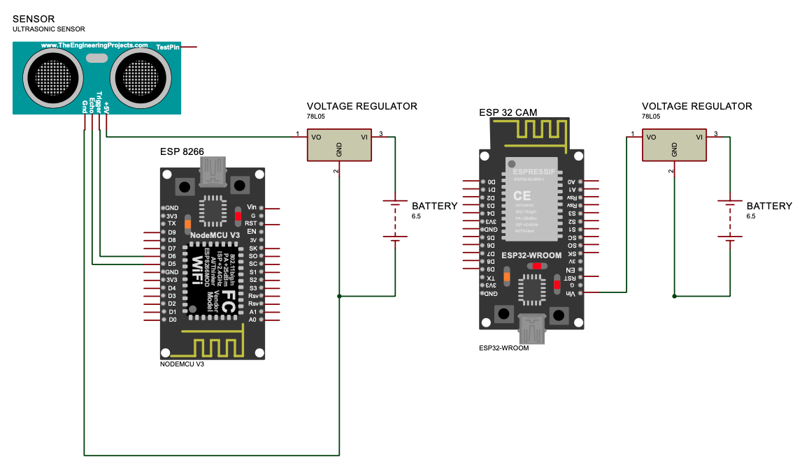
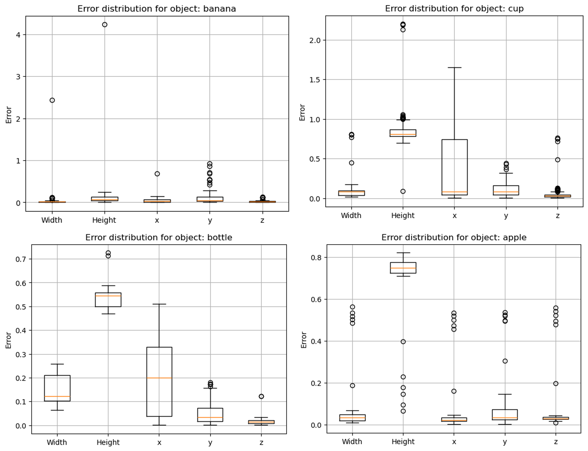
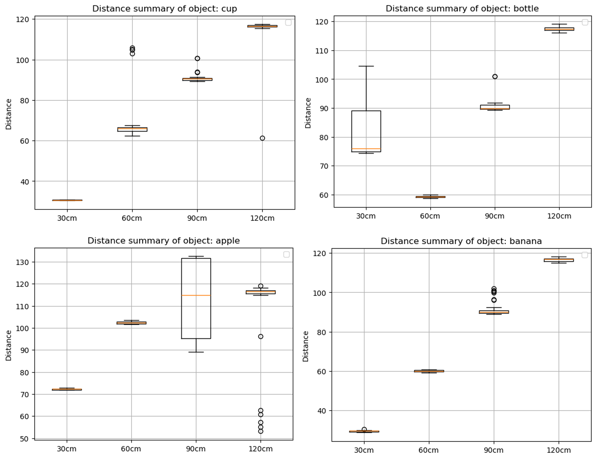
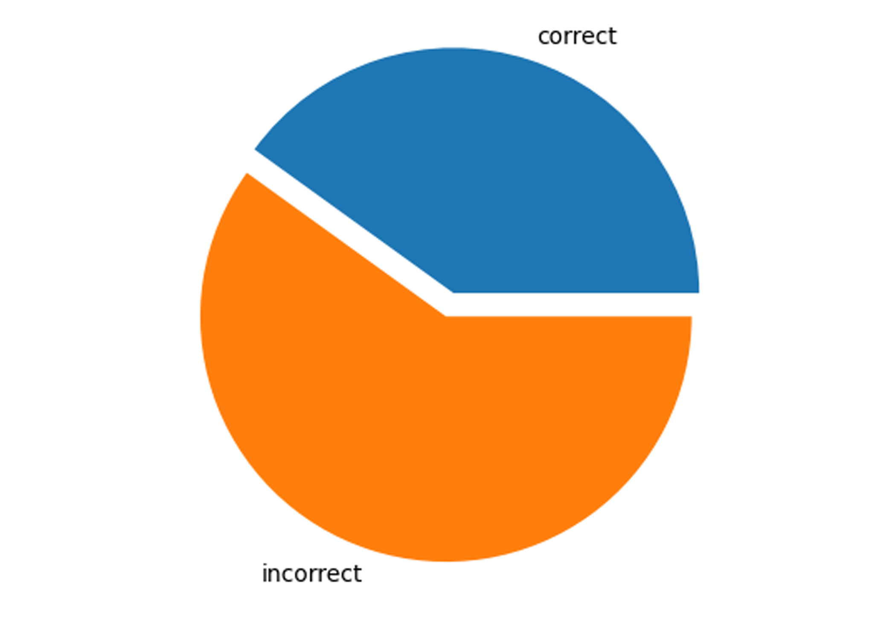
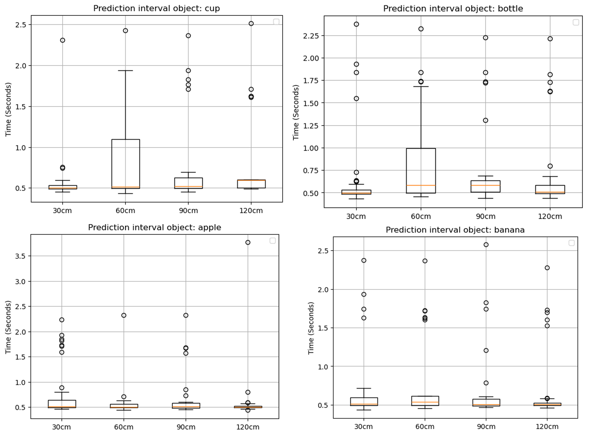

# Realtime Object Detection

## Introduction:
This is the code for the on spatial object detection.

Circuit Diagram

Circuit Design

### Experiment Summary:
|
|
|
|

### Data collected:
find tables, plots and images from the experiment here [link](https://drive.google.com/drive/folders/1MfSruVwZi-DDrN1hb1w0lYawneWl8l9s?usp=sharing)
